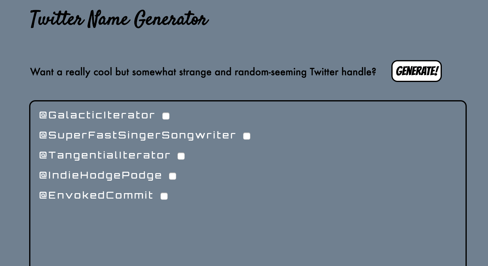

# Twitter-Generator

## What's this, Courtney?

This is a simple application I made while at code school (Prime Digital Academy) using Bootstrap, HTML5/CSS3 (obviously), JavaScript, AngularJS, Google Fonts, NodeJS, and ExpressJS.

## What does it do, Courtney?

This app grabs one random noun and one random adjective and puts them together to give you some inspiration for your next Twitter handle. For now, each generated name links to "twitter.com/[generatedname]", where you can check the availability.

